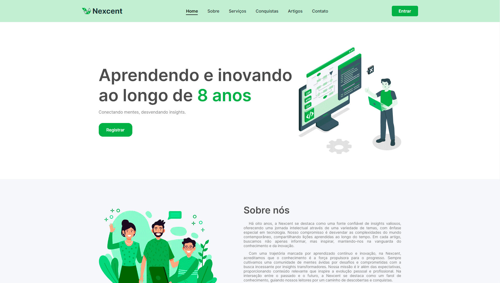

<h1 align="center">Landing Page Project</h1>

  
  
  
  

  <a href="#-tecnologias">Tecnologias</a>&nbsp;&nbsp;&nbsp;|&nbsp;&nbsp;&nbsp;
  <a href="#-projeto">Projeto</a>&nbsp;&nbsp;&nbsp;

  

<h4 align="right">
  
  [GitHub Pages](https://gabrielcenteiofreitas.github.io/Landing-Page-Project/)
</h4>
 

## 🚀 Tecnologias

Esse projeto foi desenvolvido com as seguintes tecnologias:

- HTML
- CSS
- JavaScript
- Figma

## 💻 Projeto

Uma Landing Page de uma empresa fictícia feita com o objetivo de treinar e aprimorar habilidades inspirada no design do Figma "Responsive Landing Page Design": https://www.figma.com/community/file/1222060007934600841
